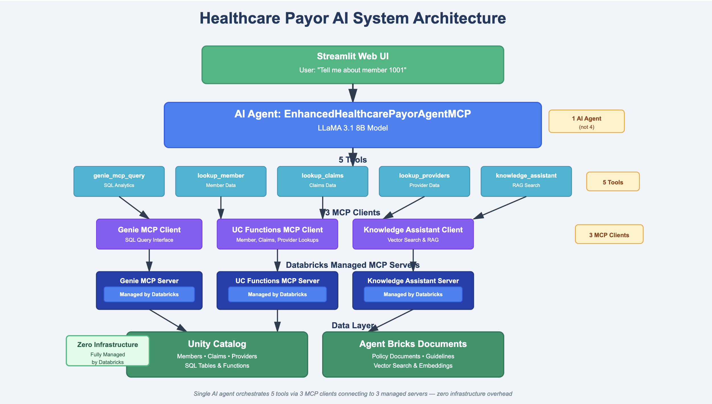

# Healthcare AI System Learning Guide: From GenAI Fundamentals to MCP Mastery
*A hands-on follow-along guide to understand the complete Healthcare Payor AI System using real code and architecture*

---

## 🎯 **Learning Path Overview**

This guide takes readers from GenAI beginner to MCP expert, covering all technologies used in the Healthcare Payor AI System. Each section builds on the previous one, with hands-on exercises and real-world examples.

**Estimated Time:** 4-6 weeks (2-3 hours per day)
**Difficulty:** Beginner to Advanced
**Prerequisites:** Basic programming knowledge (Python helpful)

---

## 📚 **Phase 1: Generative AI Fundamentals (Week 1)**

### **1.1 What is Generative AI?**

**Core Concepts:**
- **Definition**: AI that creates new content (text, code, images) based on training data
- **Large Language Models (LLMs)**: AI trained on vast text datasets to understand and generate human-like text
- **Tokens**: Basic units of text that models process (words, parts of words, punctuation)
- **Context Window**: How much text a model can "remember" in a conversation

**Key Technologies:**
- **GPT (Generative Pre-trained Transformer)**: OpenAI's models
- **Claude**: Anthropic's models (like the one powering this response!)
- **LLaMA**: Meta's open-source models
- **BERT, T5**: Earlier transformer models

**🛠️ Hands-On Exercise:**
```python
# Try this with any AI chat interface
prompt = "Explain photosynthesis in simple terms"
# Notice how the AI generates coherent, contextual responses
```

**📖 Resources:**
- [What is Generative AI? (IBM)](https://www.ibm.com/topics/generative-ai)
- [Transformer Architecture Explained](https://jalammar.github.io/illustrated-transformer/)

### **1.2 How LLMs Work**

**Technical Concepts:**
- **Transformers**: Neural network architecture that powers modern LLMs
- **Attention Mechanism**: How models focus on relevant parts of input
- **Training Process**: Pre-training → Fine-tuning → RLHF (Reinforcement Learning from Human Feedback)
- **Inference**: The process of generating responses from trained models

**Model Sizes & Capabilities:**
- **Small Models (1-8B parameters)**: Fast, efficient, good for specific tasks
- **Medium Models (8-70B parameters)**: Balanced performance and speed
- **Large Models (70B+ parameters)**: Most capable, slower, more expensive

**🛠️ Hands-On Exercise:**
```python
# Understanding model parameters in the Healthcare AI System
# The app uses: "databricks-meta-llama-3-1-8b-instruct"
# - LLaMA 3.1: Model family
# - 8B: 8 billion parameters
# - Instruct: Fine-tuned for following instructions
```

### **1.3 Prompt Engineering Basics**

**Core Principles:**
- **Clear Instructions**: Be specific about the desired outcome
- **Context Provision**: Give relevant background information
- **Output Format**: Specify how the response should be structured
- **Examples**: Show the model what good output looks like

**Prompt Patterns:**
```python
# Basic Pattern
"Act as a [ROLE]. [TASK]. [CONTEXT]. [FORMAT]."

# Healthcare Example
"Act as a healthcare data analyst. Analyze member 1001's claims data. 
Focus on recent authorizations and claim status. 
Provide a summary in bullet points."
```

**🛠️ Hands-On Exercise:**
Practice these prompts in the Healthcare AI System:
- "Explain member 1001's recent activity"
- "Compare member 1001 and 1002's claim patterns"
- "Act as a customer service representative and help with member 1003's billing question"

---

## 🔧 **Phase 2: AI Agents and Tool Usage (Week 2)**

### **2.1 What are AI Agents?**

**Definition**: AI systems that can:
- **Reason** about problems
- **Plan** sequences of actions
- **Use tools** to gather information or perform tasks
- **Adapt** based on results

**Agent Components:**
- **LLM Brain**: The reasoning engine
- **Tools**: Functions the agent can call
- **Memory**: Conversation history and context
- **Orchestrator**: Logic that decides when to use tools

**🛠️ Real Example from the App:**
```python
# The Healthcare AI Agent has these capabilities:
# 1. Reasoning: "User wants member info, I need to check UC and documents"
# 2. Tools: Genie MCP, UC Functions, Knowledge Assistant
# 3. Memory: Remembers conversation context
# 4. Orchestration: Decides which tools to use when
```

### **2.2 Function Calling / Tool Usage in the Healthcare AI System**

**🎯 Absolutely Right - Agents DO Have Tools!**

In the Healthcare AI System, tools are the bridge between MCP clients and the AI agent. Here's exactly how it works:

**🔧 Tool Creation Process:**
```python
# Step 1: MCP Clients connect to servers
self.genie_client = get_genie_mcp_client()
self.uc_functions_client = get_uc_functions_mcp_client()
self.knowledge_assistant_client = get_knowledge_assistant_mcp_client()

# Step 2: Convert MCP clients into LangChain tools
self.tools = []
genie_tool = create_genie_tool_for_langchain(self.genie_client)
uc_tools = create_uc_functions_tools_for_langchain(self.uc_functions_client)
knowledge_tool = create_knowledge_assistant_tool_for_langchain(self.knowledge_assistant_client)

# Step 3: Agent gets these tools
self.tools.extend([genie_tool] + uc_tools + [knowledge_tool])
```

**🛠️ Tool Definitions in the Healthcare AI System:**

**1. Genie Tool** (from `mcp_genie_client.py`, line 140):
```python
class GenieMCPTool(BaseTool):
    name: str = "genie_mcp_query"
    description: str = "Query structured data using natural language through Genie MCP server"
    
    def _run(self, query: str) -> str:
        # Calls the Genie MCP client to execute natural language queries
```

**2. UC Functions Tools** (from `mcp_uc_functions_client.py`, line 189):
```python
class UCMemberLookupTool(BaseTool):
    name: str = "my_catalog__payer_silver__lookup_member"
    description: str = "Returns member information from Unity Catalog"

class UCClaimsLookupTool(BaseTool):
    name: str = "my_catalog__payer_silver__lookup_claims"  
    description: str = "Returns claims for a member"

class UCProvidersLookupTool(BaseTool):
    name: str = "my_catalog__payer_silver__lookup_providers"
    description: str = "Returns providers by specialty"
```

**3. Knowledge Assistant Tool** (from `mcp_knowledge_assistant_client.py`, line 141):
```python
class KnowledgeAssistantTool(BaseTool):
    name: str = "knowledge_assistant"
    description: str = "Analyze unstructured text, documents, complaints, and knowledge base content"
```

**🔄 How the Agent Uses Tools:**

**In `enhanced_healthcare_payor_app_mcp.py` (line 198-233):**
```python
# Agent receives user query
user_input = "Tell me about member 1001"

# Agent converts tools to OpenAI format
openai_tools = []
for tool in self.tools:  # These are the MCP-based tools
    tool_spec = {
        "type": "function",
        "function": {
            "name": tool.name,
            "description": tool.description,
            "parameters": tool.args_schema.model_json_schema()
        }
    }
    openai_tools.append(tool_spec)

# LLM decides which tools to use
response = self.llm_client.chat.completions.create(
    model=AI_MODEL_NAME,
    messages=[{"role": "user", "content": user_input}],
    tools=openai_tools,  # Agent can choose from these tools
    tool_choice="auto"   # Let the AI decide which tools to use
)
```

**🎯 The Complete Flow:**
```
User: "Tell me about member 1001"
    ↓
AI Agent sees available tools:
├── genie_mcp_query (for structured data analysis)
├── my_catalog__payer_silver__lookup_member (for member profile)
├── my_catalog__payer_silver__lookup_claims (for claims data)
└── knowledge_assistant (for document search)
    ↓
AI Agent decides: "I'll use lookup_member AND knowledge_assistant"
    ↓
Tools execute through their respective MCP clients:
├── UCMemberLookupTool → UC Functions MCP → Unity Catalog
└── KnowledgeAssistantTool → Knowledge Assistant → Documents
    ↓
Agent combines tool results and responds to user
```

**🔍 Key Architecture Points:**
- **MCP Clients** = The connection layer to data sources
- **Tools** = LangChain wrappers that the AI agent can invoke
- **Agent** = The brain that decides which tools to use when
- **Each Tool** wraps an MCP client and exposes it to the AI agent

**This is why the system is so powerful - the AI agent can intelligently choose and combine multiple tools to answer complex questions!**

### **2.3 Agent Orchestration Patterns**

**Sequential Pattern**: Use tools one after another
```python
# Example: Member inquiry
# 1. First get member profile from UC
# 2. Then search documents for related issues
# 3. Combine results in response
```

**Parallel Pattern**: Use multiple tools simultaneously
```python
# Example: Comprehensive member analysis
# 1. Query UC for claims data (parallel)
# 2. Search documents for service history (parallel)
# 3. Combine all results
```

**Conditional Pattern**: Use tools based on conditions
```python
# Example: Smart routing
# If question about claims → Use UC Functions
# If question about documents → Use Knowledge Assistant
# If complex analysis → Use both
```

---

## 🏗️ **Phase 3: Model Context Protocol (MCP) Deep Dive (Week 3)**

### **3.1 What is MCP?**

**Definition**: A standardized protocol that allows AI applications to securely connect to external data sources and tools.

**Why MCP Matters:**
- **Standardization**: Common interface for all tools
- **Security**: Built-in authentication and authorization
- **Scalability**: Easy to add new data sources
- **Flexibility**: Works with any LLM or AI framework

**MCP vs Traditional APIs:**
```python
# Traditional API Integration (Complex)
def get_member_data(member_id):
    # Custom authentication
    # Custom error handling
    # Custom data formatting
    # Different for each API
    
# MCP Integration (Simple)
def get_member_data(member_id):
    # Standard MCP call
    # Built-in auth and error handling
    # Consistent interface
```

### **3.2 MCP Architecture in the Healthcare AI System App**


*Complete system architecture showing 1 AI Agent coordinating 5 tools through 3 MCP clients to access both structured and unstructured healthcare data via Databricks managed infrastructure.*

**🎯 Important Clarification: The System Has Only ONE Agent (Not 4)!**

A common misconception is thinking there are multiple agents. Here's the reality:

**❌ NOT: 1 Main Agent + 3 More Agents = 4 Agents**
**✅ ACTUALLY: 1 Agent + 3 MCP Clients + 5 Tools**

**🏗️ Actual File Structure:**

**ONE AI Agent:**
- **File**: `enhanced_healthcare_payor_app_mcp.py`
- **Class**: `EnhancedHealthcarePayorAgentMCP` (line 51)
- **Role**: The ONLY AI agent - the brain that orchestrates everything

**THREE MCP Clients (NOT Agents - these are connection layers):**
1. **`mcp_genie_client.py`**
   - **Class**: `GenieMCPClient` (line 13)
   - **Purpose**: Connects to Genie MCP Server for natural language queries

2. **`mcp_uc_functions_client.py`**
   - **Class**: `UCFunctionsMCPClient` (line 13)  
   - **Purpose**: Connects to UC Functions MCP Server for custom functions

3. **`mcp_knowledge_assistant_client.py`**
   - **Class**: `KnowledgeAssistantMCPClient` (line 20)
   - **Purpose**: Connects to Knowledge Assistant for document search

**FIVE Tools (created from the MCP clients):**
- `genie_mcp_query`
- `my_catalog__payer_silver__lookup_member`
- `my_catalog__payer_silver__lookup_claims`
- `my_catalog__payer_silver__lookup_providers`
- `knowledge_assistant`

**🔍 How They Connect:**

**In `enhanced_healthcare_payor_app_mcp.py` (Main Agent):**
```python
class EnhancedHealthcarePayorAgentMCP:
    def __init__(self):
        # Initialize all MCP clients
        self.genie_client = get_genie_mcp_client()                    # Line 77
        self.uc_functions_client = get_uc_functions_mcp_client()      # Line 80  
        self.knowledge_assistant_client = get_knowledge_assistant_mcp_client()  # Line 83
```

**MCP Client Initialization Pattern:**
```python
# Each MCP client follows this pattern:
class SomeMCPClient:
    def __init__(self):
        self.workspace_client = WorkspaceClient()  # Databricks connection
        self.mcp_client = DatabricksMCPClient()    # Actual MCP client
        
    async def connect(self):
        # Connect to specific MCP server URL
        await self.mcp_client.connect(server_url)
```

**🛠️ Real Code Example from the App:**
```python
# From mcp_genie_client.py (line 55)
self.mcp_client = DatabricksMCPClient(
    server_url=f"https://{workspace_hostname}/api/2.0/mcp/genie/{genie_space_id}",
    workspace_client=self.workspace_client
)
```

**Message Flow in the App:**
```
User Query (Streamlit UI)
    ↓
EnhancedHealthcarePayorAgentMCP (Main Agent)
    ↓
Decides which MCP clients to use:
├── GenieMCPClient → Genie MCP Server → Unity Catalog
├── UCFunctionsMCPClient → UC Functions MCP Server → Unity Catalog  
└── KnowledgeAssistantMCPClient → Knowledge Assistant → Documents
    ↓
Combines results and responds to user
```

**🎯 Key Architecture Points:**
- **One Agent, Multiple Clients**: The main agent uses multiple MCP clients
- **Each Client = One MCP Server**: Each client connects to a specific MCP server type
- **Databricks MCP Library**: Uses `databricks_mcp.DatabricksMCPClient` for connections
- **Async Operations**: All MCP calls are asynchronous for performance

### **3.3 Databricks Managed MCP Servers**

**What Makes Them Special:**
- **Zero Deployment**: No infrastructure to manage
- **Built-in Security**: Databricks authentication
- **Auto-scaling**: Handles load automatically
- **Enterprise Ready**: Monitoring, logging, compliance

**Three Types:**

**1. Genie MCP Server**
```python
# Purpose: Natural language queries against structured data
# URL: https://<workspace>/api/2.0/mcp/genie/{space_id}
# Example: "Show me all members with denied claims"
```

**2. Unity Catalog Functions MCP Server**
```python
# Purpose: Execute custom Python/SQL functions
# URL: https://<workspace>/api/2.0/mcp/functions/{catalog}/{schema}
# Example: lookup_member('1001') → Member profile data
```

**3. Vector Search MCP Server**
```python
# Purpose: Semantic search through documents
# URL: https://<workspace>/api/2.0/mcp/vector-search/{catalog}/{schema}
# Example: Find documents related to "prior authorization"
```

### **3.4 Building MCP Clients**

**Basic MCP Client Pattern:**
```python
import mcp

# 1. Initialize MCP client
client = mcp.Client()

# 2. Connect to MCP server
await client.connect("https://workspace/api/2.0/mcp/genie/space_id")

# 3. List available tools
tools = await client.list_tools()

# 4. Call a tool
result = await client.call_tool("query_members", {"filter": "plan_type=PLN101"})
```

**🛠️ Exercise - Explore the App's MCP Usage:**
Look at `enhanced_healthcare_payor_app_mcp.py` and find:
- How it connects to MCP servers
- How it defines tools for the LLM
- How it handles tool responses

---

## 🧠 **Phase 4: RAG (Retrieval-Augmented Generation) (Week 3-4)**

### **4.1 What is RAG?**

**Problem**: LLMs have knowledge cutoffs and can't access real-time or private data

**Solution**: RAG combines:
- **Retrieval**: Find relevant information from external sources
- **Augmentation**: Add that information to the prompt
- **Generation**: LLM generates response using both its training and retrieved data

**RAG Pipeline:**
```
User Query → Retrieve Relevant Docs → Augment Prompt → Generate Response
```

### **4.2 RAG Components**

**1. Document Processing:**
- **Chunking**: Break documents into smaller pieces
- **Embedding**: Convert text to numerical vectors
- **Storage**: Store embeddings in vector database

**2. Retrieval:**
- **Query Embedding**: Convert user question to vector
- **Similarity Search**: Find most relevant document chunks
- **Ranking**: Order results by relevance

**3. Generation:**
- **Context Injection**: Add retrieved docs to prompt
- **LLM Processing**: Generate response with context
- **Citation**: Reference source documents

### **4.3 Agent Bricks: Knowledge Assistant**

**What It Is**: Databricks' managed RAG solution that makes document intelligence effortless.

**Key Features:**
- **Point-and-click setup**: No complex RAG implementation needed
- **Automatic document processing**: Handles chunking, embedding, indexing
- **Quality improvement**: Expert feedback loops and AI evaluation
- **Enterprise integration**: Unity Catalog volumes, built-in security

**🛠️ How the App Uses It:**
```python
# Traditional RAG (Complex)
# 1. Chunk documents manually
# 2. Generate embeddings
# 3. Store in vector database
# 4. Build retrieval system
# 5. Handle citations
# 6. Manage quality

# Agent Bricks: Knowledge Assistant (Simple)
# 1. Upload documents to Unity Catalog
# 2. Configure Knowledge Assistant
# 3. Get RAG endpoint ready for production
```

### **4.4 Vector Databases and Embeddings**

**Embeddings**: Numerical representations of text that capture semantic meaning
```python
# Example embeddings (simplified)
"member claims" → [0.2, 0.8, 0.1, 0.9, ...]
"patient billing" → [0.3, 0.7, 0.2, 0.8, ...]  # Similar to above
"weather forecast" → [0.9, 0.1, 0.8, 0.2, ...]  # Very different
```

**Vector Databases**: Specialized databases for storing and searching embeddings
- **Similarity Search**: Find vectors close to query vector
- **Filtering**: Combine semantic search with metadata filters
- **Scaling**: Handle millions of documents efficiently

**🛠️ Exercise - Understanding the App's RAG:**
1. Look at the prior authorization documents
2. Imagine how they're chunked and embedded
3. Try queries that should retrieve specific document sections

---

## 🏢 **Phase 5: Unity Catalog and Data Governance (Week 4)**

### **5.1 What is Unity Catalog?**

**Definition**: Databricks' unified governance solution for data and AI assets across clouds.

**Core Capabilities:**
- **Centralized Metadata**: Single source of truth for all data
- **Fine-grained Access Control**: Row, column, and function-level security
- **Data Lineage**: Track data flow across systems
- **Audit Logging**: Complete audit trail for compliance

**Three-Level Namespace:**
```
Catalog.Schema.Table
my_catalog.payer_silver.members
my_catalog.payer_silver.claims
```

### **5.2 Unity Catalog in the Healthcare System**

**Data Structure in the App:**
```python
# Catalog: my_catalog
# Schema: payer_silver
# Tables:
# - members (demographics, plan info)
# - claims (claim status, amounts)
# - providers (network info)
# Functions:
# - lookup_member() - Get member profile
# - get_claims() - Get member claims
```

**🛠️ Exercise - Explore the Data:**
```sql
-- These are the types of queries the UC Functions execute
SELECT member_id, first_name, last_name, plan_id 
FROM my_catalog.payer_silver.members 
WHERE member_id = '1001'
```

### **5.3 Unity Catalog Functions**

**What They Are**: Custom Python/SQL functions stored in Unity Catalog that can be called by AI agents.

**Benefits:**
- **Reusable**: Define once, use everywhere
- **Secure**: Built-in access controls
- **Governed**: Tracked and audited
- **AI-Friendly**: Easy for agents to discover and use

**Example Function:**
```python
# UC Function: lookup_member
def lookup_member(member_id: str) -> dict:
    """Get complete member profile including demographics and plan info"""
    # Query Unity Catalog tables
    # Return structured member data
```

---

## 🚀 **Phase 6: Putting It All Together - The Healthcare AI System (Week 5)**

### **6.1 System Architecture Overview**


*The complete Healthcare Payor AI System architecture - from user interface through AI agent orchestration to managed Databricks services and data sources.*

**Complete Technology Stack:**
```
Streamlit UI
    ↓
AI Agent (LLaMA 3.1 8B)
    ↓
MCP Client
    ↓
Three MCP Servers:
├── Genie MCP (Natural language queries)
├── UC Functions MCP (Custom functions)  
└── Vector Search MCP (Document search)
    ↓
Unity Catalog + Knowledge Assistant
    ↓
Healthcare Data (Members, Claims, Documents)
```

### **6.2 Data Flow Example**

**User Query**: "Tell me about member 1001's recent issues"

**System Response Flow:**
1. **AI Agent** receives query and decides to use multiple tools
2. **UC Functions MCP** called to get member profile
3. **Knowledge Assistant** searches documents for member 1001
4. **Genie MCP** queries claims data for member 1001
5. **AI Agent** combines all results into comprehensive response

### **6.3 Configuration Management**

**Configuration Structure in `config.py`:**
```python
# Unity Catalog Settings
CATALOG_NAME = "my_catalog"
SCHEMA_NAME = "payer_silver"

# MCP Server Settings  
WORKSPACE_HOSTNAME = "workspace-hostname.azuredatabricks.net"
GENIE_SPACE_ID = "genie-space-id"

# AI Model Settings
AI_MODEL_NAME = "databricks-meta-llama-3-1-8b-instruct"

# Knowledge Assistant Settings
KNOWLEDGE_ASSISTANT_ENDPOINT_ID = "ka-endpoint-id"
```

### **6.4 Understanding the Code**

**Key Files to Study:**
1. **`enhanced_healthcare_payor_app_mcp.py`** - Main application
2. **`config.py`** - Configuration management
3. **`mcp_genie_client.py`** - Genie MCP integration
4. **`mcp_knowledge_assistant_client.py`** - Knowledge Assistant integration

**🛠️ Code Reading Exercise:**
1. Trace through a user query from UI to response
2. Identify where each MCP server is called
3. Understand how tools are defined for the AI agent

---

## 🎯 **Phase 7: Advanced Topics and Best Practices (Week 6)**

### **7.1 Production Considerations**

**Performance Optimization:**
- **Model Selection**: Balance capability vs speed vs cost
- **Caching**: Cache frequent queries and responses
- **Parallel Processing**: Use multiple tools simultaneously
- **Connection Pooling**: Reuse MCP connections

**Security Best Practices:**
- **Authentication**: Proper Databricks token management
- **Authorization**: Row-level security in Unity Catalog
- **Data Privacy**: PII handling and masking
- **Audit Logging**: Complete trail of AI decisions

### **7.2 Monitoring and Observability**

**Key Metrics:**
- **Response Time**: How long queries take
- **Tool Usage**: Which MCP servers are called most
- **Error Rates**: Failed queries and their causes
- **User Satisfaction**: Quality of AI responses

**Logging Strategy:**
```python
# Log all AI agent decisions
logger.info(f"User query: {query}")
logger.info(f"Tools selected: {selected_tools}")
logger.info(f"Response generated in: {response_time}ms")
```

### **7.3 Scaling and Deployment**

**Local Development:**
- Use `run_demo.sh` for testing
- Configure `config.py` for the environment
- Test with sample data

**Cloud Deployment:**
- Use `app.yaml` for Databricks Apps
- Environment variables for configuration
- Managed MCP servers handle scaling automatically

### **7.4 Troubleshooting Common Issues**

**Connection Problems:**
```python
# Check MCP server connectivity
curl -H "Authorization: Bearer $token" \
  https://workspace/api/2.0/mcp/genie/space_id/health
```

**Performance Issues:**
- Check model selection (8B vs 70B)
- Review query complexity
- Monitor Unity Catalog query performance

**Quality Issues:**
- Review prompt engineering
- Check Knowledge Assistant training data
- Validate Unity Catalog function outputs

---

## 📚 **Essential Resources and References**

### **Official Documentation:**
1. **Databricks MCP**: https://learn.microsoft.com/en-us/azure/databricks/generative-ai/mcp/managed-mcp
2. **Agent Bricks**: https://learn.microsoft.com/en-us/azure/databricks/generative-ai/agent-bricks/knowledge-assistant
3. **Unity Catalog**: https://docs.databricks.com/data-governance/unity-catalog/
4. **Model Context Protocol**: https://modelcontextprotocol.io/

### **Learning Platforms:**
1. **Databricks Academy**: Free courses on Unity Catalog and AI
2. **Coursera**: "Generative AI for Everyone" by Andrew Ng
3. **YouTube**: "AI Explained" channel for technical deep dives

### **Hands-On Practice:**
1. **The Healthcare AI System**: Best learning environment
2. **Databricks Community Edition**: Free tier for experimentation
3. **OpenAI Playground**: Practice prompt engineering

### **Books:**
1. **"Hands-On Large Language Models"** by Jay Mody & Meor Amer
2. **"Building LLM Applications"** by Valentina Alto
3. **"AI Engineering"** by Chip Huyen

---

## 🎯 **Learning Milestones and Checkpoints**

### **Week 1 Checkpoint:**
- [ ] Understand what GenAI and LLMs are
- [ ] Can explain transformers and attention
- [ ] Write effective prompts for the Healthcare AI System

### **Week 2 Checkpoint:**
- [ ] Understand AI agents and tool usage
- [ ] Can identify tools in the Healthcare system
- [ ] Explain agent orchestration patterns

### **Week 3 Checkpoint:**
- [ ] Understand MCP protocol and architecture
- [ ] Know the three Databricks MCP server types
- [ ] Can explain RAG and Agent Bricks

### **Week 4 Checkpoint:**
- [ ] Understand Unity Catalog and data governance
- [ ] Can write basic SQL queries for the data
- [ ] Understand UC Functions and their role

### **Week 5 Checkpoint:**
- [ ] Can trace through the entire system architecture
- [ ] Understand configuration management
- [ ] Can modify and extend the Healthcare AI System

### **Week 6 Checkpoint:**
- [ ] Know production best practices
- [ ] Can troubleshoot common issues
- [ ] Ready to build AI applications using MCP

---

## 🚀 **Next Steps: Building AI Applications**

### **Project Ideas:**
1. **Extend the Healthcare System**: Add new data sources or capabilities
2. **Different Industry**: Apply MCP pattern to finance, retail, etc.
3. **Custom MCP Server**: Build your own MCP server for specific data sources

### **Advanced Topics to Explore:**
- **Fine-tuning**: Customize models for your specific domain
- **Multi-modal AI**: Combine text, images, and structured data
- **Agent Frameworks**: LangChain, CrewAI, AutoGen
- **MLOps**: Model deployment, monitoring, and lifecycle management

---

## 📞 **Getting Help**

### **Community Resources:**
- **Databricks Community**: Forums and user groups
- **GitHub Issues**: For the Healthcare AI System project
- **Stack Overflow**: Tag questions with 'databricks', 'mcp', 'llm'

### **Professional Support:**
- **Databricks Support**: For platform-specific issues
- **Databricks Professional Services**: For enterprise implementations
- **AI/ML Consultants**: For complex custom solutions

---

**🎉 Congratulations! By following this guide, readers will go from GenAI beginner to MCP expert, fully prepared to demo and extend the Healthcare Payor AI System!**

*Remember: The best way to learn is by doing. Use the Healthcare AI System as a playground to experiment with these concepts while learning them.*
