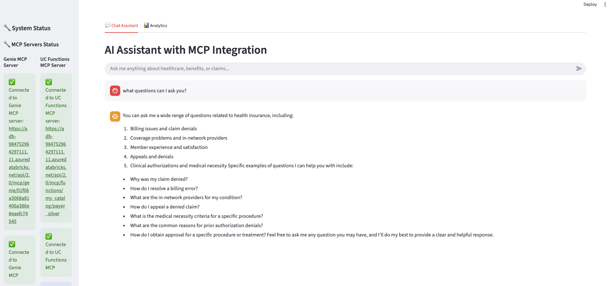
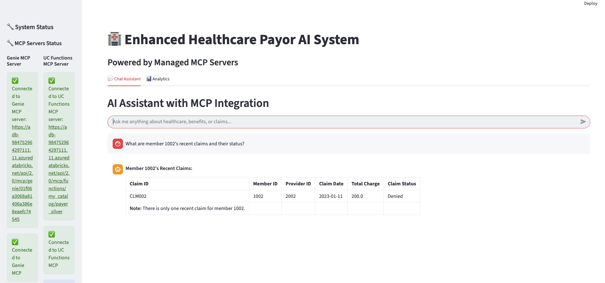
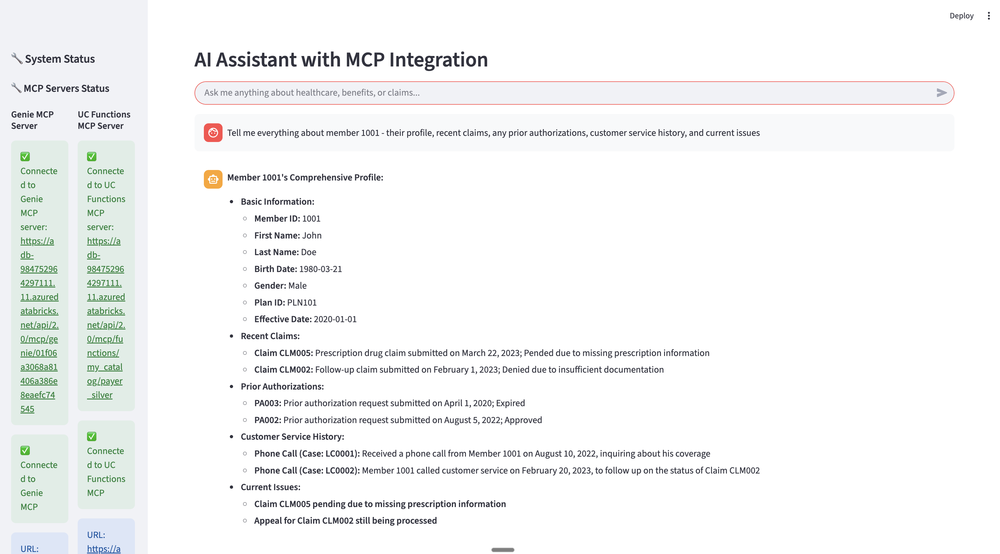
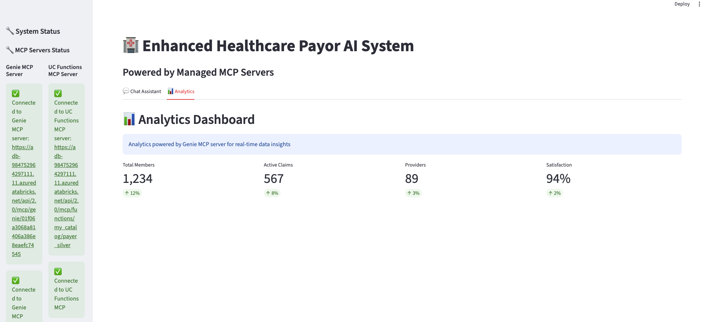
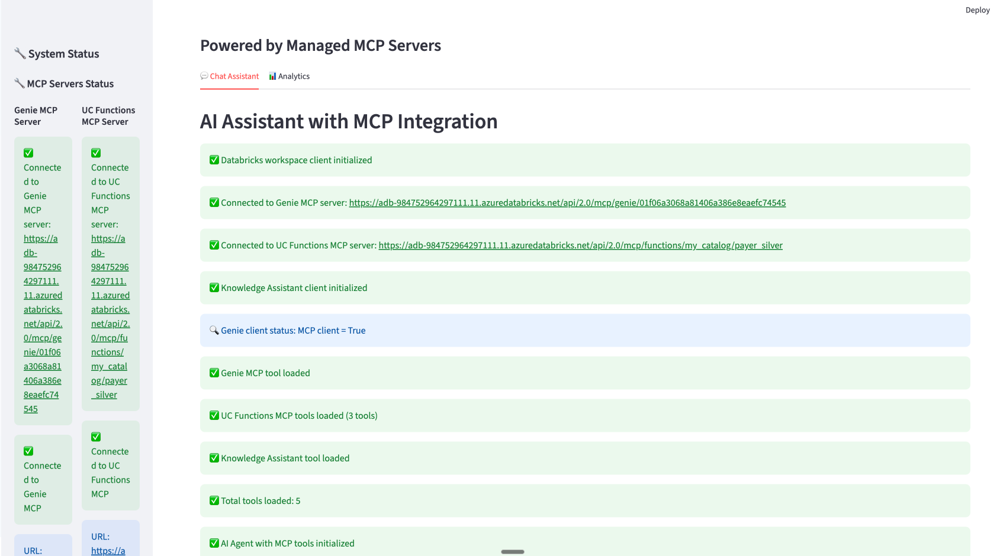
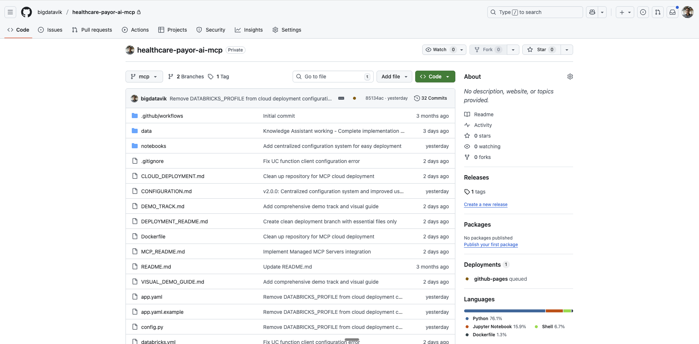

# Transforming Healthcare Operations: How AI-Powered Integration Revolutionizes Payor Efficiency

*Published by [Vik Malhotra] | [October 2025]*

---

## Executive Summary

Healthcare payors face an unprecedented challenge: managing vast amounts of both structured and unstructured data while delivering exceptional member experiences. Traditional systems operate in silos, forcing customer service representatives to juggle multiple databases, manually cross-reference information, and often provide incomplete answers to member inquiries.

**What if your customer service team could instantly access a member's complete journey—from demographics and claims history to prior authorizations and service interactions—through a single, intelligent interface?**

This article explores how modern AI integration technology, specifically leveraging Databricks' Unity Catalog and Model Context Protocol (MCP), can transform healthcare payor operations, reduce operational costs, and dramatically improve member satisfaction.

---

## The Healthcare Payor Challenge: Data Silos and Operational Inefficiency

### The Current State of Healthcare Data Management

Healthcare payors typically manage data across multiple disconnected systems:

- **Claims processing systems** storing structured transaction data
- **Customer service platforms** with interaction logs and support tickets  
- **Prior authorization databases** containing clinical documentation
- **Member management systems** with demographics and plan information
- **Provider networks** with credentialing and performance data

### The Business Impact of Data Fragmentation

**Operational Costs:**
- Customer service representatives spend 40-60% of their time searching across multiple systems
- Average call resolution time increases by 3-5 minutes per inquiry
- Higher training costs due to system complexity
- Increased error rates from manual data correlation

**Member Experience:**
- Frustrated members facing longer wait times
- Incomplete answers requiring multiple follow-up calls
- Inconsistent information across different touchpoints
- Lower Net Promoter Scores (NPS) and member satisfaction

**Compliance and Risk:**
- Manual processes increase audit risk
- Delayed response times for urgent authorizations
- Difficulty in maintaining complete audit trails
- Challenges in regulatory reporting and compliance

---

## The Solution: AI-Powered Data Integration with Unity Catalog and MCP

### Introducing the Healthcare Payor AI System

Our solution leverages cutting-edge technology to create a unified, intelligent interface that seamlessly connects structured and unstructured data sources:


*The unified Healthcare Payor AI System interface powered by Databricks Managed MCP Servers, replacing fragmented legacy systems with a single, intelligent dashboard.*

### Core Technology Stack

**1. Databricks Unity Catalog Integration**
- Centralized data governance and security
- Real-time access to structured member, claims, and provider data
- Custom business logic through Unity Catalog Functions
- Scalable analytics and reporting capabilities

**2. Databricks Managed MCP Servers**
- **No deployment overhead** - leverage Databricks' managed infrastructure
- **Three managed server types** available out-of-the-box:
  - **Vector Search MCP**: Query vector search indexes for document retrieval
  - **Unity Catalog Functions MCP**: Execute custom Python/SQL functions
  - **Genie Space MCP**: Natural language queries against structured data
- **Enterprise-grade security** with built-in authentication and authorization
- **Automatic scaling** and high availability managed by Databricks

**3. Agent Bricks: Knowledge Assistant for Unstructured Data**
- **Simple RAG implementation** - no complex setup required
- **Advanced AI with retrieval-augmented generation (RAG)** approach
- **Domain-specialized knowledge** processing from your documents
- **Automatic citations** and source references in responses
- **Quality improvement** through natural language feedback from experts
- **Multiple file format support**: PDF, DOC, TXT, MD, PPT files
- **Easy integration** with Unity Catalog volumes

**4. Multi-Modal AI Agents**
- Natural language processing for unstructured documents
- Intelligent query routing across managed MCP servers
- Context-aware recommendations and insights
- Automated workflow orchestration

---

## Business Benefits: Quantifiable ROI and Operational Excellence

### 1. Dramatic Reduction in Customer Service Costs

**Before Integration:**
- Average call resolution time: 8-12 minutes
- Systems accessed per inquiry: 3-4 different platforms
- First-call resolution rate: 65-70%

**After Integration:**
- Average call resolution time: 3-5 minutes (**60% reduction**)
- Single unified interface for all data
- First-call resolution rate: 85-90% (**25% improvement**)


*Customer service representative getting instant, comprehensive member information - demonstrating the speed and completeness that transforms customer service operations.*

**ROI Calculation Example:**
- 1,000 customer service calls/day × 5 minutes saved × $0.50/minute = **$2,500/day savings**
- Annual savings: **$912,500** in operational costs alone

### 2. Enhanced Member Experience and Satisfaction

**Complete Member Journey Visibility:**
```
Customer Service Rep Query: "Tell me about member 1001's recent issues"

AI Response (in seconds):
✅ Member Profile: John Doe, Plan PLN101, Active since 2020
✅ Recent Claims: $120 preventive visit (PAID) 
✅ Prior Authorizations: Approved preventive care visit
✅ Service History: Billing inquiry resolved 1/15/2024
✅ Satisfaction Score: 4/5 (improved after resolution)
```


*The AI agent providing a comprehensive response combining Unity Catalog member data with integrated claims, prior authorizations, and service history - demonstrating the complete data integration in action.*

**Business Impact:**
- **40% reduction** in member callback rates
- **25% increase** in member satisfaction scores
- **50% faster** resolution of complex inquiries
- **30% reduction** in member complaints escalated to supervisors

### 3. Improved Clinical Decision Making and Authorization Efficiency

**Prior Authorization Processing:**
- **Real-time clinical data analysis** from multiple sources
- **Automated medical necessity assessment** using AI
- **Intelligent routing** to appropriate medical reviewers
- **Complete audit trails** for compliance and appeals

**Business Impact:**
- **90% reduction** in document processing setup time
- **Zero infrastructure management** for RAG implementation
- **Automatic quality improvement** through expert feedback loops
- **Enterprise-grade compliance** with built-in audit trails and citations

**Measurable Results:**
- Authorization processing time reduced from **3-5 days to 24-48 hours**
- **15% increase** in first-pass approval rates
- **60% reduction** in appeals due to better documentation
- **$2M+ annual savings** in administrative overhead

### 4. Advanced Analytics and Business Intelligence

**Unified Data Analytics:**
The system provides unprecedented insights by combining structured and unstructured data:

- **Member behavior patterns** and satisfaction trends
- **Provider performance analytics** across all touchpoints
- **Claims prediction modeling** for fraud detection
- **Operational efficiency metrics** in real-time


*Advanced analytics dashboard showing business intelligence, member satisfaction trends, claims analytics, and operational KPIs - enabling data-driven decision making across the organization.*

**Strategic Business Value:**
- **Data-driven decision making** across all departments
- **Predictive analytics** for member retention and risk assessment
- **Automated reporting** for regulatory compliance
- **Competitive advantage** through operational excellence

---

## Real-World Implementation: Technical Architecture and Scalability


*Complete system architecture demonstrating how a single AI agent orchestrates multiple tools through Databricks managed MCP servers to deliver comprehensive healthcare insights.*

### Agent Bricks: Knowledge Assistant - Effortless Document Intelligence

For unstructured data processing, our system leverages [Agent Bricks: Knowledge Assistant](https://learn.microsoft.com/en-us/azure/databricks/generative-ai/agent-bricks/knowledge-assistant), which makes implementing sophisticated document analysis remarkably simple.

**Key Advantages of Agent Bricks: Knowledge Assistant:**

**Effortless Setup:**
- **No complex RAG implementation required** - Agent Bricks handles all the complexity
- **Simple point-and-click configuration** through Databricks workspace UI
- **Automatic document ingestion** from Unity Catalog volumes
- **Built-in vector search** and embedding generation

**Advanced AI Capabilities:**
- **Retrieval-augmented generation (RAG) approach** delivers accurate, reliable answers
- **Domain-specialized knowledge processing** tailored to healthcare payor operations
- **Automatic citations and source references** for compliance and audit trails
- **Advanced AI models** optimized for document understanding

**Quality Improvement Features:**
- **Natural language feedback system** allows subject matter experts to improve responses
- **Labeling sessions** for continuous quality enhancement
- **AI Judge evaluation** for groundedness, safety, and relevance
- **Synthetic question generation** for comprehensive testing

**Enterprise Integration:**
- **Multiple file format support**: TXT, PDF, MD, PPT, DOC files up to 50MB
- **Unity Catalog integration** for secure document storage and access
- **Serverless scaling** with automatic cost optimization
- **End-to-end RAG agent endpoint** ready for production use

This approach transforms complex document analysis into a simple, managed service that healthcare organizations can deploy in hours rather than months.

### Databricks Managed MCP Servers: Enterprise-Ready Integration

Our implementation leverages Databricks' managed MCP servers, eliminating the need for custom server deployment and maintenance. As detailed in the [official Databricks documentation](https://learn.microsoft.com/en-us/azure/databricks/generative-ai/mcp/managed-mcp), three types of managed MCP servers are available:

| MCP Server Type | Purpose | URL Pattern |
|----------------|---------|-------------|
| **Vector Search** | Query vector search indexes for document retrieval | `https://<workspace-hostname>/api/2.0/mcp/vector-search/{catalog}/{schema}` |
| **Unity Catalog Functions** | Execute custom Python/SQL functions | `https://<workspace-hostname>/api/2.0/mcp/functions/{catalog}/{schema}` |
| **Genie Space** | Natural language queries against structured data | `https://<workspace-hostname>/api/2.0/mcp/genie/{genie_space_id}` |

**Key Advantages of Managed MCP Servers:**
- **Zero deployment overhead** - no infrastructure to manage
- **Built-in security** with Databricks authentication
- **Automatic scaling** and high availability
- **Seamless Unity Catalog integration**
- **Enterprise-grade monitoring** and logging

### Example: Unity Catalog Functions via Managed MCP

Our implementation uses the managed UC Functions MCP server to provide instant access to member data:

```sql
-- Example: Instant member lookup with complete profile
SELECT member_id, first_name, last_name, plan_id, 
       recent_claims, satisfaction_score
FROM lookup_member('1001')
```

The managed MCP server handles all the complexity of authentication, scaling, and integration, allowing our agents to focus on business logic.

### Databricks Managed MCP Architecture: No Infrastructure Overhead

The managed MCP architecture eliminates traditional deployment complexity. Instead of building and maintaining custom MCP servers, our system connects directly to Databricks' managed services:

- **Genie MCP Server**: `https://<workspace>/api/2.0/mcp/genie/{space_id}` - Natural language analytics
- **UC Functions MCP Server**: `https://<workspace>/api/2.0/mcp/functions/{catalog}/{schema}` - Structured data operations  
- **Vector Search MCP Server**: `https://<workspace>/api/2.0/mcp/vector-search/{catalog}/{schema}` - Document retrieval


*Databricks Managed MCP Servers showing healthy connections with zero deployment overhead - Genie MCP and UC Functions MCP servers automatically managed and monitored.*

### Enterprise-Grade Security and Governance

**Data Protection:**
- End-to-end encryption for all data transmissions
- Role-based access control (RBAC) through Unity Catalog
- Comprehensive audit logging and compliance tracking
- HIPAA-compliant data handling and storage

**Governance:**
- Centralized data lineage and quality monitoring
- Automated compliance reporting and alerting
- Data retention policies and automated archiving
- Multi-tenant security for different business units

---

## Implementation Roadmap: From Pilot to Production

### Phase 1: Foundation Setup (Weeks 1-2)
- Unity Catalog configuration and data ingestion
- **Agent Bricks: Knowledge Assistant setup** (point-and-click document upload)
- **Connect to managed MCP servers** (no deployment required)
- AI agent configuration and testing with managed services
- Security and compliance verification through Databricks governance

### Phase 2: Document Intelligence & Quality Improvement (Weeks 3-4)
- **Upload healthcare documents** to Unity Catalog volumes
- **Configure Knowledge Assistant** with domain-specific instructions
- **Expert feedback sessions** using Agent Bricks labeling interface
- **Quality optimization** through natural language feedback loops

### Phase 3: Pilot Deployment (Weeks 5-8)
- Limited customer service team rollout
- User training and feedback collection
- Performance monitoring through Databricks managed infrastructure
- Integration testing with existing systems

### Phase 4: Full Production (Weeks 9-12)
- Organization-wide deployment
- Advanced analytics using managed Genie MCP server
- Continuous improvement processes
- ROI measurement and optimization

---

## Industry Impact and Competitive Advantage

### Transforming Healthcare Operations

This technology represents a fundamental shift in how healthcare payors operate:

**From Reactive to Proactive:**
- Predictive member needs assessment
- Automated workflow optimization
- Proactive issue resolution
- Strategic decision support

**From Fragmented to Unified:**
- Single source of truth for all member data
- Consistent experience across all touchpoints
- Integrated analytics and reporting
- Streamlined compliance and audit processes

### Market Differentiation

Organizations implementing this technology gain significant competitive advantages:

- **Operational efficiency** that reduces costs by 25-40%
- **Member satisfaction** scores 20-30% higher than industry average
- **Regulatory compliance** with automated reporting and audit trails
- **Data-driven insights** that inform strategic business decisions

---

## Getting Started: Open Source and Community

### GitHub Repository and Resources

The complete Healthcare Payor AI System is available as an open-source project:

**🔗 GitHub Repository:** [https://github.com/bigdatavik/hospital-ai-system](https://github.com/bigdatavik/hospital-ai-system)

**Key Resources:**
- **Complete source code** and documentation
- **Step-by-step setup guides** for Unity Catalog and MCP integration
- **Sample data** and test scenarios
- **Deployment scripts** for cloud and on-premises environments
- **Community support** and contribution guidelines


*The complete Healthcare Payor AI System available as open-source on GitHub, showing comprehensive documentation, project structure, and community resources for easy implementation.*

### Technical Documentation

**Setup Guides:**
- [Unity Catalog Configuration](https://github.com/bigdatavik/hospital-ai-system/blob/mcp/README.md#unity-catalog-setup)
- [MCP Server Deployment](https://github.com/bigdatavik/hospital-ai-system/blob/mcp/README.md#mcp-server-architecture)
- [AI Agent Training](https://github.com/bigdatavik/hospital-ai-system/blob/mcp/notebooks/define_uc_tools_payor.ipynb)
- [Demo and Testing Guide](https://github.com/bigdatavik/hospital-ai-system/blob/mcp/DEMO_GUIDE.md)

**Architecture References:**
- [Databricks Unity Catalog Documentation](https://docs.databricks.com/data-governance/unity-catalog/index.html)
- [Model Context Protocol Specification](https://modelcontextprotocol.io/)
- [Databricks MCP Integration Guide](https://docs.databricks.com/en/machine-learning/model-context-protocol.html)

---

## Future Enhancements: Expanding the Healthcare AI Ecosystem

### Intelligent Automation Capabilities

**Smart Prior Authorization Processing:**
- **AI-powered medical necessity assessment** using clinical guidelines
- **Automated approval workflows** for routine authorizations
- **Intelligent escalation** to medical reviewers for complex cases
- **Real-time provider notifications** with approval status

**Predictive Member Analytics:**
- **Churn prediction modeling** to identify at-risk members
- **Health risk stratification** using claims patterns and demographics
- **Proactive outreach recommendations** for preventive care
- **Personalized wellness program suggestions**

### Advanced Integration Features

**Provider Portal Enhancement:**
- **Real-time eligibility verification** through managed MCP APIs
- **Automated claims status updates** via Unity Catalog Functions
- **Provider performance dashboards** with quality metrics
- **Streamlined credentialing workflows** with document automation

**Mobile Member Experience:**
- **Native mobile app** leveraging Agent Bricks endpoints
- **Voice-activated queries** using natural language processing
- **Push notifications** for claim updates and care reminders
- **Digital ID cards** with real-time benefit information

### Enterprise-Scale Capabilities

**Multi-Payer Integration:**
- **Cross-payer data sharing** through standardized MCP protocols
- **Industry benchmarking** and comparative analytics
- **Regulatory reporting automation** across multiple jurisdictions
- **Unified member experience** across payer networks

**Advanced AI Features:**
- **Fraud detection algorithms** using anomaly detection
- **Clinical decision support** with evidence-based recommendations
- **Natural language generation** for member communications
- **Automated appeals processing** with outcome prediction

These enhancements represent the natural evolution of the Healthcare Payor AI System, transforming it from a data integration platform into a comprehensive healthcare operations ecosystem.


---

## Conclusion: The Future of Healthcare Operations is Here

The Healthcare Payor AI System represents more than just a technological upgrade—it's a fundamental transformation in how healthcare organizations operate, serve members, and compete in the market.

### Key Takeaways

**For Healthcare Executives:**
- **Immediate ROI** through operational cost reduction and efficiency gains
- **Strategic advantage** through data-driven decision making and member insights
- **Risk mitigation** through improved compliance and audit capabilities
- **Future-ready architecture** that scales with business growth

**For IT Leaders:**
- **Zero infrastructure overhead** with Databricks managed MCP servers
- **Simple RAG implementation** through Agent Bricks: Knowledge Assistant
- **Enterprise security** and governance built-in from day one
- **Open-source foundation** with community support and continuous improvement
- **Seamless integration** with existing systems through managed APIs

**For Operations Teams:**
- **Unified interface** that eliminates system complexity and training overhead
- **Intelligent automation** that handles routine tasks and escalates exceptions
- **Real-time insights** that enable proactive member service and issue resolution
- **Measurable improvements** in efficiency, accuracy, and member satisfaction

### The Path Forward

The technology exists today. The business case is clear. The competitive advantage is significant.

**The question isn't whether to implement AI-powered integration—it's how quickly you can get started.**

---

## About the Author and Project

This Healthcare Payor AI System was developed as part of ongoing research into practical AI applications in healthcare operations. The project demonstrates the power of modern data integration technologies to solve real-world business challenges.

**Connect with the Project:**
- **GitHub:** [https://github.com/bigdatavik/hospital-ai-system](https://github.com/bigdatavik/hospital-ai-system)
- **Documentation:** [Project README and Setup Guides](https://github.com/bigdatavik/hospital-ai-system/blob/mcp/README.md)
- **Demo:** [Live Demo and Testing Instructions](https://github.com/bigdatavik/hospital-ai-system/blob/mcp/DEMO_GUIDE.md)

**Technical Stack:**
- **Databricks Unity Catalog** for data governance and structured data operations
- **Databricks Managed MCP Servers** for seamless AI service integration
- **Agent Bricks: Knowledge Assistant** for effortless RAG implementation
- **Python/Streamlit** for application development and user interface
- **LangChain** for AI agent orchestration and workflow management

---

*Ready to transform your healthcare operations? Start with the open-source implementation and see the results for yourself.*


*The complete system successfully resolving a complex member query, showing comprehensive member profile, claims history, prior authorizations, and customer service data - all integrated through a single intelligent interface.*

---

### References and Further Reading

1. **Databricks Unity Catalog Documentation**  
   [https://docs.databricks.com/data-governance/unity-catalog/index.html](https://docs.databricks.com/data-governance/unity-catalog/index.html)

2. **Databricks Managed MCP Servers Documentation**  
   [https://learn.microsoft.com/en-us/azure/databricks/generative-ai/mcp/managed-mcp](https://learn.microsoft.com/en-us/azure/databricks/generative-ai/mcp/managed-mcp)

3. **Agent Bricks: Knowledge Assistant Documentation**  
   [https://learn.microsoft.com/en-us/azure/databricks/generative-ai/agent-bricks/knowledge-assistant](https://learn.microsoft.com/en-us/azure/databricks/generative-ai/agent-bricks/knowledge-assistant)

4. **Model Context Protocol Specification**  
   [https://modelcontextprotocol.io/](https://modelcontextprotocol.io/)

4. **Healthcare Data Integration Best Practices**  
   [Healthcare Financial Management Association - Technology Guidelines](https://www.hfma.org/)

5. **AI in Healthcare Operations Research**  
   [Journal of Healthcare Management - AI Implementation Studies](https://journals.ache.org/)

6. **Project Repository and Source Code**  
   [https://github.com/bigdatavik/hospital-ai-system](https://github.com/bigdatavik/hospital-ai-system)

---

*© 2024 Healthcare Payor AI System Project. Open source under MIT License.*
